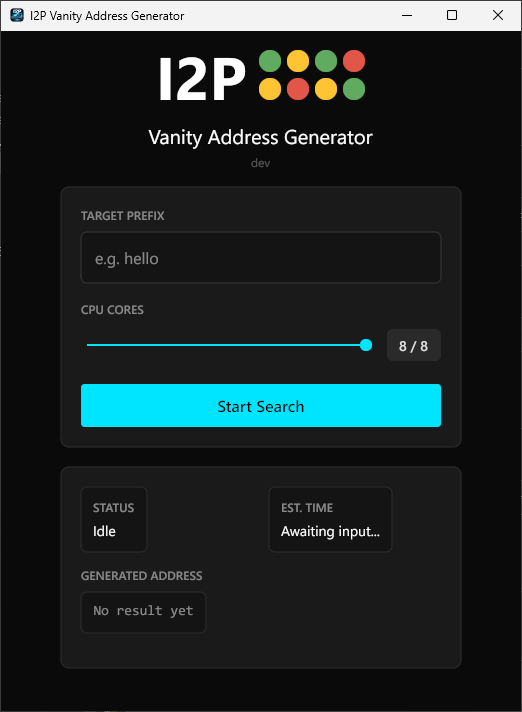
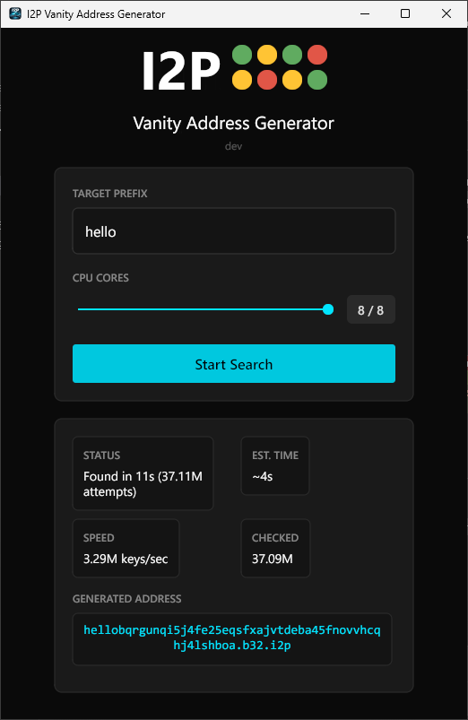

# Vanity Domain Generator

A cross-platform desktop application for generating vanity I2P (`.b32.i2p`) and Tor v3 (`.onion`) addresses with custom prefixes. GPU accelerated.

Instead of accepting a randomly generated address, search for one that starts with a meaningful prefix like `hello`, `stormy`, or `yourhandle`.

<p align="center">
  
  &nbsp;&nbsp;
  
</p>

## Features

- **I2P + Tor v3** — generate vanity `.b32.i2p` and `.onion` addresses
- **GPU acceleration** — Metal (macOS), OpenCL (Windows/Linux) for massively parallel key searching
- **Parallel CPU generation** — uses all available CPU cores (~500K keys/sec per core for I2P, ~300K for Tor)
- **Real-time progress** — live speed, checked count, and estimated time to find a match
- **Auto-update** — checks for new releases on GitHub and updates in-place
- **Code signed** — all platform binaries are signed and verifiable
- **Dark mode UI** — clean, modern interface built with [Gio](https://gioui.org)

## Download

Grab the latest release for your platform from [Releases](https://github.com/StormyCloudInc/Vanity-Generator/releases/latest).

| Platform | Architecture | File |
|----------|-------------|------|
| Windows | x86_64 | `vanitygenerator_windows_signed.exe` |
| macOS | Apple Silicon | `vanitygenerator_mac_silicon_signed.dmg` |
| Linux | x86_64 | `vanitygenerator_linux_signed` |

All binaries are code signed:
- **Windows** — Authenticode (right-click → Properties → Digital Signatures)
- **macOS** — Notarized + stapled DMG
- **Linux** — Detached PKCS#7 signature (`.p7s` file)

## Usage

1. Launch the application
2. Select your network — **I2P** or **Tor v3**
3. Enter your desired prefix (valid characters: `a-z`, `2-7` for I2P; `a-z`, `2-7` for Tor)
4. Adjust the CPU cores slider and enable GPU if available
5. Click **Start Search**
6. When a match is found, click **Save Keys** to export the private keys

### I2P

The exported `.dat` file contains your I2P destination and private keys. Keep it safe — anyone with this file can operate the corresponding hidden service.

### Tor v3

Keys are saved as a hidden service directory (`hs_ed25519_secret_key`, `hs_ed25519_public_key`, `hostname`) compatible with Tor's `HiddenServiceDir`.

### How long will it take?

Each additional character in the prefix increases the search space by 32x. GPU acceleration can dramatically reduce these times.

**I2P (.b32.i2p) — CPU only, 8 cores:**

| Prefix Length | Expected Time |
|:---:|---|
| 1 | Instant |
| 2 | Instant |
| 3 | ~8 seconds |
| 4 | ~4 minutes |
| 5 | ~2 hours |
| 6 | ~3 days |
| 7 | ~86 days |

With GPU acceleration (OpenCL/Metal), I2P searches run ~100M+ keys/sec, reducing a 5-character search to seconds.

## Build from Source

**Requirements:** Go 1.24+, CGO enabled for GPU support

```bash
# Clone
git clone https://github.com/StormyCloudInc/Vanity-Generator.git
cd Vanity-Generator

# Build (dev version)
go build -o vanitygenerator .
```

### Platform-specific builds

**Windows** (includes GUI subsystem flag and embedded resources):
```bash
go install github.com/tc-hib/go-winres@latest
go-winres make
GOOS=windows GOARCH=amd64 CGO_ENABLED=1 \
  go build -ldflags "-H=windowsgui -s -w" -o vanitygenerator.exe .
```

**Linux** (requires Gio + OpenCL dependencies):
```bash
sudo apt-get install -y gcc pkg-config libwayland-dev libx11-dev \
  libx11-xcb-dev libxkbcommon-x11-dev libgles2-mesa-dev \
  libegl1-mesa-dev libffi-dev libxcursor-dev libvulkan-dev \
  ocl-icd-opencl-dev

GOOS=linux GOARCH=amd64 CGO_ENABLED=1 \
  go build -ldflags "-s -w" -o vanitygenerator .
```

**macOS:**
```bash
GOOS=darwin GOARCH=arm64 CGO_ENABLED=1 \
  go build -ldflags "-s -w" -o vanitygenerator .
```

## How It Works

### I2P

The generator creates I2P destinations using Ed25519 signing keys and checks if the resulting base32 address starts with the target prefix. Each CPU core runs an independent search loop, mutating the encryption key via a counter to produce different destination hashes without regenerating the full key pair each time. On GPU, the SHA-256 hash computation is offloaded to thousands of parallel threads.

When a match is found, the destination (391 bytes) and private keys are saved to a `.dat` file compatible with I2P router software.

### Tor v3

Tor v3 onion addresses are derived from Ed25519 public keys via SHA-3 (SHAKE-256). The generator uses a hybrid approach: the CPU performs key expansion (scalar clamping + base point multiply) while the GPU checks candidate public keys against the target prefix. Keys are saved in Tor's hidden service directory format.

## Configuration

Settings are stored in your platform's config directory (`~/.config/i2p-vanitygen/config.json` on Linux, `%APPDATA%` on Windows):

- **GPU preference** — remember whether GPU acceleration is enabled
- **Network preference** — last selected network (I2P or Tor)
- **Update preferences** — skipped version tracking for the auto-updater

## Credits

Built with the following open-source libraries:

- [Gio](https://gioui.org) — cross-platform GUI framework for Go
- [filippo.io/edwards25519](https://github.com/FiloSottile/edwards25519) — Ed25519 elliptic curve operations
- [golang.org/x/crypto](https://pkg.go.dev/golang.org/x/crypto) — SHA-3/SHAKE-256 for Tor v3 address derivation
- [go-text/typesetting](https://github.com/go-text/typesetting) — text shaping and rendering
- [golang.org/x/image](https://pkg.go.dev/golang.org/x/image) — image processing support

## License

[MIT](LICENSE) — Copyright 2026 StormyCloud Inc
